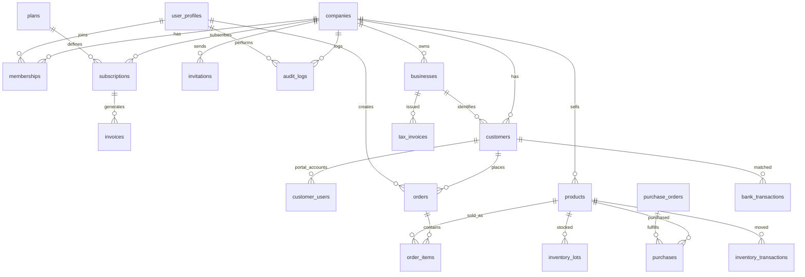

# ERD — 데이터베이스 스키마

> 20개 테이블, 23개 관계, 8개 비즈니스 계산식

## 색상 그룹 범례

| 색상 | 의미 | 테이블 수 |
|---|---|---|
| 🔴 `#ef4444` | 인증/테넌트 | 5 (companies, user_profiles, memberships, invitations, audit_logs) |
| 🟠 `#f97316` | 과금 | 3 (plans, subscriptions, invoices) |
| 🔵 `#3b82f6` | 비즈니스 마스터 | 2 (businesses, customers) |
| 🔷 `#06b6d4` | 판매 | 3 (customer_users, orders, order_items) |
| 🟢 `#10b981` | 상품·재고·매입 | 5 (products, inventory_lots, inventory_transactions, purchases, purchase_orders) |
| 🟣 `#8b5cf6` | 재무 | 2 (bank_transactions, tax_invoices) |

---

## 관계 다이어그램 (Mermaid)

---

## 테이블 명세 (요약)

### 🔴 인증/테넌트 그룹

**companies** — 회사(테넌트)
- `id` UUID PK, `name` VARCHAR(200) NOT NULL, `business_number` VARCHAR(20), `industry` VARCHAR(50)
- `status` VARCHAR(20) NOT NULL DEFAULT 'trial' (trial/active/suspended)
- `trial_ends_at` TIMESTAMPTZ NOT NULL DEFAULT NOW() + 14 days
- 공통 타임스탬프 3종

**user_profiles** — auth.users와 연계
- `id` UUID PK → auth.users(id) FK, `email`, `name`, `phone`, `is_super_admin` BOOLEAN, `last_login_at`

**memberships** — 회사별 사용자 역할
- `user_id` FK, `company_id` FK, `role` (owner/admin/member), UNIQUE(user_id, company_id)

**invitations** — 팀원 초대
- `company_id`, `email`, `role`, `token` UNIQUE, `expires_at`, `accepted_at`

**audit_logs** — 감사 로그 (immutable)
- `company_id`, `actor_id`, `action`, `target_type`, `target_id`, `created_at`
- **updated_at 없음** (로그는 불변)

### 🟠 과금 그룹

**plans** — 요금제
- `id` VARCHAR(50) PK (free/starter/pro/business)
- `name`, `price_krw` INTEGER, `max_users`, `max_products`, `max_orders_per_month`
- `has_api_access` BOOLEAN, `is_active` BOOLEAN

**subscriptions** — 회사별 구독 상태
- `company_id`, `plan_id` FK, `status` (active/past_due/canceled)
- `current_period_start/end`, `toss_billing_key`, `canceled_at`

**invoices** — 결제 내역
- `company_id`, `subscription_id`, `amount`, `status` (paid/failed/pending)
- `paid_at`, `invoice_number`

### 🔵 비즈니스 마스터

**businesses** — 세금계산서 발행 단위 (사업자번호 기준)
- `business_number` VARCHAR(20) NOT NULL, `name` VARCHAR(200), `representative`
- `business_type` (업태), `business_item` (종목), `address`

**customers** — 거래처
- `business_id` FK (nullable, 사업자 정보 연결)
- `name`, `contact1/2`, `email`, `delivery_address`
- `grade` A~E, `settlement_cycle` (당월/익월/2개월), `bank_aliases` TEXT (쉼표 구분, 학습 누적)
- `is_active` BOOLEAN

### 🔷 판매 그룹

**customer_users** — 거래처 포털 로그인 계정 (Supabase Auth 아님)
- `customer_id` FK, `login_id`, `password_hash` (bcrypt), `last_login_at`
- UNIQUE(company_id, login_id)

**orders** — 주문
- `customer_id` FK, `order_date`, `total_amount`, `status` (draft/confirmed/shipped/done)
- `source` (manual/portal/ai), `memo`, `created_by` FK → user_profiles

**order_items**
- `order_id` FK, `product_id` FK, `quantity`, `unit_price`, `amount`, `is_return` BOOLEAN

### 🟢 상품·재고·매입

**products**
- `code` UNIQUE(company_id, code), `name`, `category`
- `sell_price`, `supply_price`, `unit_price_usd` NUMERIC(10,2), `unit` (ea/box/dz)

**inventory_lots** — FIFO 로트
- `product_id`, `lot_type` (opening/purchase/import), `quantity`, `remaining_quantity`
- `cost_krw`, `cost_usd`, `lot_date`

**inventory_transactions** — 재고 이동
- `product_id`, `type` (out/return/damage), `quantity`, `memo`, `transaction_date`

**purchase_orders** — 발주서
- `po_number` UNIQUE(company_id, po_number), `po_date`, `template_id`
- `currency` (USD/KRW/EUR), `total_amount` NUMERIC(15,2), `status` (draft/sent/confirmed)

**purchases** — 수입/매입
- `product_id`, `type` (import/domestic), `quantity`, `unit_cost_usd`, `exchange_rate`
- `total_krw`, `purchase_date`, `purchase_order_id` FK (nullable)

### 🟣 재무

**bank_transactions** — 은행 입출금 내역
- `customer_id` FK (nullable, 매칭 완료 시), `transaction_date`, `amount`
- `type` (deposit/withdraw), `depositor_name`, `description`
- `match_status` (matched/unmatched/excluded), `is_excluded` BOOLEAN

**tax_invoices** — 세금계산서 발행 이력
- `business_id` FK, UNIQUE(business_id, invoice_year, invoice_month)
- `invoice_year`, `invoice_month` (1~12), `total_amount`, `supply_amount`, `vat_amount`
- `exported_at`

---

## 설계 핵심 결정 5종

1. **businesses ↔ customers 분리**
   세금계산서는 사업자번호 단위로 발행하지만, 주문·배송은 거래처(지점/담당자) 단위. 한 사업자에 여러 거래처 가능.

2. **거래처 포털 = 별도 인증 (customer_users)**
   SaaS 사용자(auth.users)와 거래처 포털 사용자는 완전히 분리. bcrypt로 자체 로그인.

3. **발주서 템플릿 모듈 방식 (template_id)**
   MVP는 USD 1개 템플릿만. 미래 확장(EUR, KRW, 다른 공급사) 대비.

4. **입금자 자동매칭 학습 (customers.bank_aliases)**
   사용자가 매칭 확정 시 depositor_name을 bank_aliases에 누적 추가 → 다음번 자동 매칭.

5. **FIFO 로트 기반 재고 (inventory_lots.remaining_quantity)**
   단순 total stock 필드가 아니라 로트별 잔량 관리 → 원가 정확 계산 + 연말 이월 쉬움.

---

## 비즈니스 계산식 8종

> 모두 `src/utils/calculations.ts` 단일 파일에 구현. 첫 인자는 항상 `companyId`.

| 이름 | 공식 | 사용처 |
|---|---|---|
| `calcCurrentStock` | 기초재고 + 수입/매입 + 반품 - 파손 - 판매수량(올해) | 재고현황, 포털 주문 |
| `calcMonthlySales` | SUM(quantity × unit_price) WHERE 해당기간 | 홈, 손익계산서 |
| `calcReceivables` | 거래처별 총매출 - 거래처별 총입금 | 미수금, 거래처 |
| `calcCostOfSales` | (기초 + 반품 - 파손 + 수입/매입 - 기말) × 1.1 | 손익계산서 |
| `calcInventoryValue` | 현재재고수량 × 가중평균단가 × 1.1 | 홈, 재고현황 |
| `calcSupplyAmount` | 매출금액 ÷ 1.1 (역산) | 세금계산서 |
| `calcOrderSuggestion` | (과거6개월판매/6 × 3개월) / 12 [DZ] | 발주서 추천 |
| `calcMRR` | SUM(plans.price_krw) WHERE subscriptions.status='active' | Super Admin |

---

## 관계 23개 전체

| # | From | FromCol | → | To | ToCol | 관계 |
|---|---|---|---|---|---|---|
| 1 | memberships | user_id | → | user_profiles | id | N:1 |
| 2 | memberships | company_id | → | companies | id | N:1 |
| 3 | subscriptions | company_id | → | companies | id | N:1 |
| 4 | subscriptions | plan_id | → | plans | id | N:1 |
| 5 | invoices | subscription_id | → | subscriptions | id | N:1 |
| 6 | invitations | company_id | → | companies | id | N:1 |
| 7 | businesses | company_id | → | companies | id | N:1 |
| 8 | customers | company_id | → | companies | id | N:1 |
| 9 | customers | business_id | → | businesses | id | N:1 |
| 10 | customer_users | customer_id | → | customers | id | N:1 |
| 11 | products | company_id | → | companies | id | N:1 |
| 12 | orders | customer_id | → | customers | id | N:1 |
| 13 | order_items | order_id | → | orders | id | N:1 |
| 14 | order_items | product_id | → | products | id | N:1 |
| 15 | inventory_lots | product_id | → | products | id | N:1 |
| 16 | inventory_transactions | product_id | → | products | id | N:1 |
| 17 | purchases | product_id | → | products | id | N:1 |
| 18 | bank_transactions | customer_id | → | customers | id | N:1 |
| 19 | tax_invoices | business_id | → | businesses | id | N:1 |
| 20 | audit_logs | company_id | → | companies | id | N:1 |
| 21 | audit_logs | actor_id | → | user_profiles | id | N:1 |
| 22 | orders | created_by | → | user_profiles | id | N:1 |
| 23 | purchases | purchase_order_id | → | purchase_orders | id | N:1 |

암묵적: 모든 `company_id` FK는 `companies.id` 참조.
